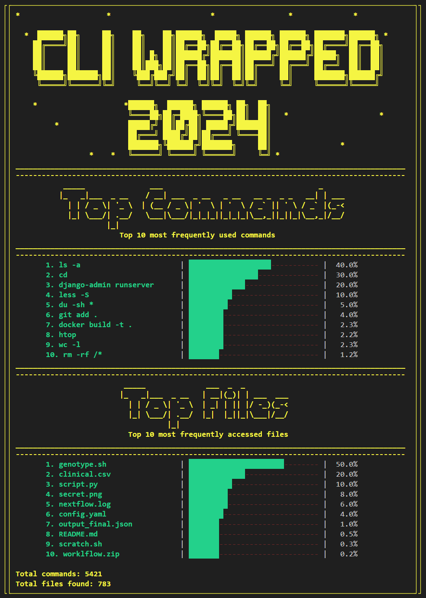

# CLI Wrapped 2024

Since normally at the end of the year people are showing their memory wrapped for the year, this Python script provides a simple CLI wrapped summarizing the most frequently used commands and accessed files based on the shell history file. The total number of commands analyzed might depend on the `HISTSIZE` environment variable as this variable decides how much you want to store the command history.

---

## Requirements

- Python 3.6+
- Bash shell with `.bash_history` enabled.
- Python Libraries:
  - `colorama`
  - `shlex`

Install dependencies using pip:

```bash
pip install colorama 
```
---

## Usage
Clone the repository:
```bash
git clone <repository_url>
cd cli-wrap
```
Then run:
```bash
python cli_wrapped.py
```
---

## Note
If you are not using Bash, change the `.bash_history` to other shell history file.

---
## Output

